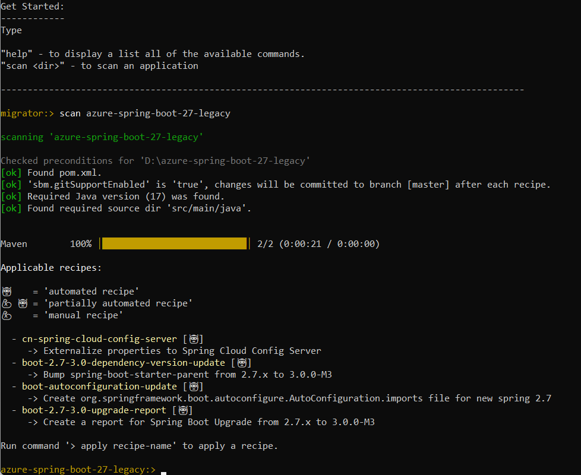
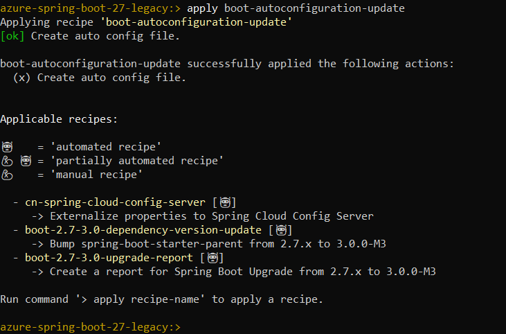
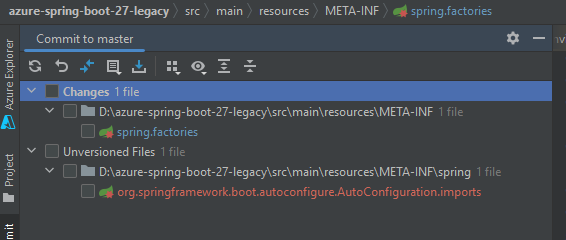
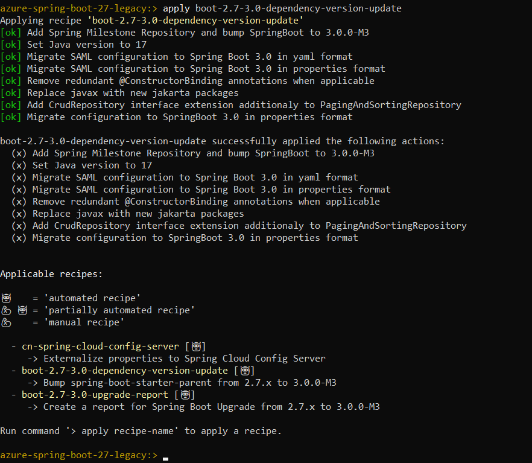
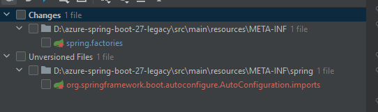

# Sample project for using Spring Cloud Azure KeyVault Secret and Spring Cloud Azure Stream Binder EventHubs

This project is targeted to demo the Spring Cloud Azure libraries 4.4.1 usage, then migrate to Spring Boot 3.0 and Spring Cloud Azure 6.0 in a Windows system.

## Prerequisites
- Java version 11 and 17
- Spring Cloud version 2021.0.4
- Spring Cloud Azure 4.4.1
- [An Azure subscription](https://azure.microsoft.com/free/)
- [Azure CLI](https://docs.microsoft.com/cli/azure/install-azure-cli)
- Maven

## Setup configuration on Azure

### Create a service principal

[Create an Azure service principal with the Azure CLI](https://learn.microsoft.com/cli/azure/create-an-azure-service-principal-azure-cli)

Save the response data for next step configuration.

### Create Azure Storage Account

[Create a storage account](https://learn.microsoft.com/azure/storage/common/storage-account-create?tabs=azure-portal)

### Create Azure EventHubs

Create an event hubs namespace and an event hub, see [Create an event hub using Azure portal](https://learn.microsoft.com/azure/event-hubs/event-hubs-create)

### Create Azure Key Vault

Create a key vault to store other resource credentials, see [Create a key vault using the Azure portal](https://learn.microsoft.com/en-us/azure/key-vault/general/quick-create-portal)

### Configure secrets in Azure Key Vault Secret

The application will read the credentials of the Event HUbs and Storage Account, which store in Secrets of the Key Vault. 
Create below 3 secrets in Key Vault:
- eventhubsconnstring, it stores the connection string of the Event Hubs namespace.
- storageaccountname, it stores the storage account name of the Storage Account.
- storageaccountkey, it stores the access key of the Storage Account.

## Run and verify

### Run locally with Maven

Open your Command prompt, run `mvn clean spring-boot:run`.

```shell
mvn clean spring-boot:run
```

Send a request to send a message to Event Hub.

```shell
curl -X POST http://localhost:8080/message/send -H "Content-Type: application/json" -d "{\"content\":\"demo migration\"}"
```

### Verify this sample

Verify the below logs:

```text
Sending message: GenericMessage [payload=DemoEvent{id='1667872542592', content='demo'}, headers={id=52e066d8-fa00-fb04-6570-a38af8bc2595, timestamp=1667872542594}]
```

```text
Message 'DemoEvent{id='1667872542592', content='demo'}' successfully checked.
```

## Upgrade to Spring Boot 3 and Spring Cloud Azure 6

Upgrade to Spring Boot 3.0.0 and Spring Cloud Azure 6.0.0, we expect some known changes can be done by the migration tool `spring-boot-migrator`, it will enhance the Spring Boot 3 support.

### Use spring-boot-migrator to upgrade

1. Update your environment variable `JAVA_HOME` to refer the Java 17.
2. Download the latest release from https://github.com/spring-projects-experimental/spring-boot-migrator/releases.
3. Make your project versioned by Git, which means committing all the changes before scanning the project.
4. Run the jar file with below command:
   `java -jar spring-boot-migrator.jar`
5. Acquire the recipes with below command:
   `scan azure-spring-boot-27-legacy`
   

   The applicable recipes will be listed in console, there will be the below 3 types:
   - automated recipe
   - partially automated recipe
   - manual recipe

6. Apply the recipe `boot-autoconfiguration-update` to use the new registration file for registering the auto configuration class.
   `apply boot-autoconfiguration-update`
   

   After applying the recipe, a log of `SBM: applied recipe 'boot-autoconfiguration-update'` was committed locally.
 
   Actually, the changes are not committed successfully.
   

7. Apply the recipe `boot-2.7-3.0-dependency-version-update` to upgrade dependencies.
   `apply boot-2.7-3.0-dependency-version-update`
   

    After applying the recipe, a log of `SBM: applied recipe 'boot-2.7-3.0-dependency-version-update'` was committed locally.

   Actually, partially changes are committed successfully, not all.
   

    Note: The recipe `boot-2.7-3.0-dependency-version-update` will include the recipe `boot-autoconfiguration-update` migration, so we can use this recipe directly.

8. Apply the recipe `boot-2.7-3.0-upgrade-report` to get the upgrade report.
   `apply boot-2.7-3.0-upgrade-report`

   The file *SPRING_BOOT_3_UPGRADE_REPORT.html* was generated in the project root path.

    

    After applying the recipe, a log of `SBM: applied recipe 'boot-2.7-3.0-upgrade-report'` was committed locally.

## Run and verify

[Re-run and verify](#run-and-verify) again.